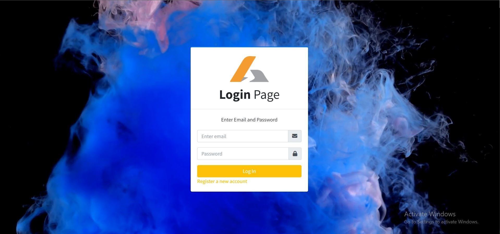
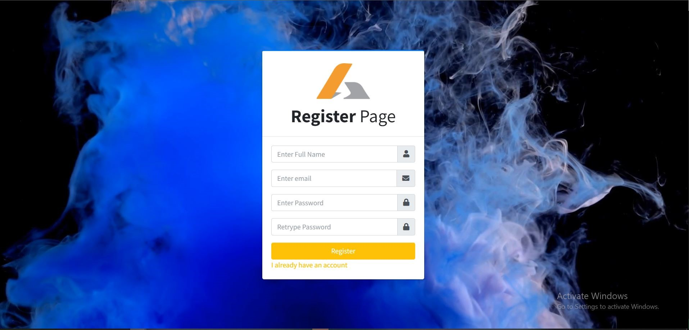
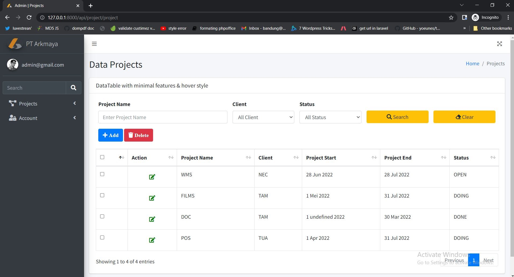

## About Project

This is Mini Project Assestment with PT. CITRARAYA NUSATAMA:

## Account
email    : admin@gmail.com
password : admin

## Setting Configuration
1. running apache, mysql in Xampp/Mamp for run local server
2. create new database 'db_project_aries' in http://localhost/phpmyadmin/
3. import file this file ['db_project_aries.sql'](https://drive.google.com/file/d/11ja3mpUJrY5JAJSf-ka0HjDqtkK9t7q9/view?usp=sharing).
4. Download Zip file and Extract
5. open project in text editor (Visual Studio) 
8. in terminal do some scripts
9. 'composer install' and 'php artisan key:generate' 'php artisan jwt:secret'
10. for running project server typing 'php artisan serve'
11. project successfully running

## Route List
1. http://127.0.0.1:8000/login                -> login page
2. http://127.0.0.1:8000/register             -> register page
3. http://127.0.0.1:8000/api/project/project  -> dashboard page

# Notes 
> Create Account
  - name -> required
  - email -> required|email
  - password -> required 
  - password2 -> required|equalto:password

> Create/Update Project
  - project_name -> required
  - client_name -> required
  - project_start -> required 
  - project_end -> required
  - project_status -> required

> Delete Project
  - selected item by checked the checkbox

> Filter Project
  - entry project name, client name and project status

> Clear Project
  - clear the filter search project and refresh data

> JWT Auth
 - Every post request need tocken to access
 - token expired 15 meanutes in backend, and would refresh token every 15 meanutes in frontend tho

> Main Jquery/javascript located in public/assets/js/custom.js

> Technology 
- Token : [JWT Auth Tymon Design](https://github.com/tymondesigns/jwt-auth)
- Backend : [Laravel PHP](https://laravel.com/docs/9.x/installation)
- Frontend : [Jquery](https://jquery.com/), Ajax, [Datatable](https://datatables.net/), [Bootstrap](https://getbootstrap.com/docs/4.0/getting-started/introduction/)
- CRUD Form :[Pop up modal](https://getbootstrap.com/docs/4.0/components/modal/)
- Validation Form : [Jquery validation](https://jqueryvalidation.org/)
- Alert : [basic alert](https://www.w3schools.com/jsref/met_win_alert.asp), [sweetalert2](https://sweetalert2.github.io/)
- Icon : [Font-awesome](https://fontawesome.com/)
- Template Admin : [AdminLte 3.20](https://codeload.github.com/ColorlibHQ/AdminLTE/zip/refs/tags/v3.2.0)
- Store loggin user : [Localstorage](https://www.w3schools.com/jsref/prop_win_localstorage.asp)

> Database Migrations
Actually you can create database in project directly by typing 'php artisan migrate' in cmd/terminal on root project

### Layout

